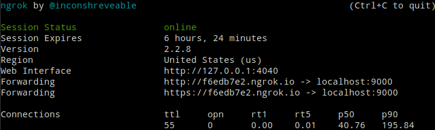
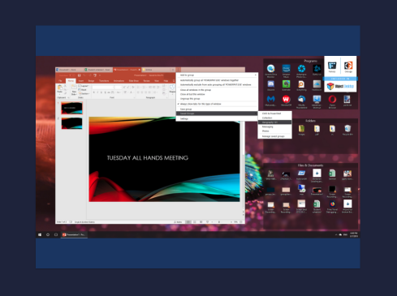

# Screencast

A light weight cast mirror for share your screen


### Based on [Revel](https://revel.github.io/) framework

## Usage

You can run screen casting in [local](#local-usage) or [external](#extern-usage) network.

To use them, just run
```console
foo@bar:~$ .\scast -addr localhost -port 8080 -q 50 -br 24 
```
#### Where flags:
* *addr* - addres of screen cast server.
Used "localhost" by default.
* *port* - port of screen cast server. 8080 by default.
* *q* - image quality (40 by default). Determine quality of the image stream. Value must be between 0 and 100.
* *br* - bitrate of the stream (frames per seconds). Used for determine how many image frames will be send to client per second.

# Local usage

You can run stream in local network.
Just setup *-addr* flag to value of your current IP on machine. For see IP address you may use commands below:

#### linux
```console
foo@bar:~$ ifconfig
```

#### windows
```console
C:\> ipconfig
```

Then open any browser in local network, and you will see the mirror stream of your screen.

# Extern usage

You can run stream in external network (internet).
Just setup *-addr* flag to value of your extern IP or URL address.
If you don't have an extern IP address, you will able to download program which do create tunnel to localhost. Like [Ngrok](https://ngrok.com/) for example.

#### Run ngrok

```console
foo@bar:~$ ngrok http 9000
```



Then run scast

```console
foo@bar:~$ ./scast -port 9000
```

Open any browser on http://f6edb7e2.ngrok.io and you will see the page like below



## Enjoy!